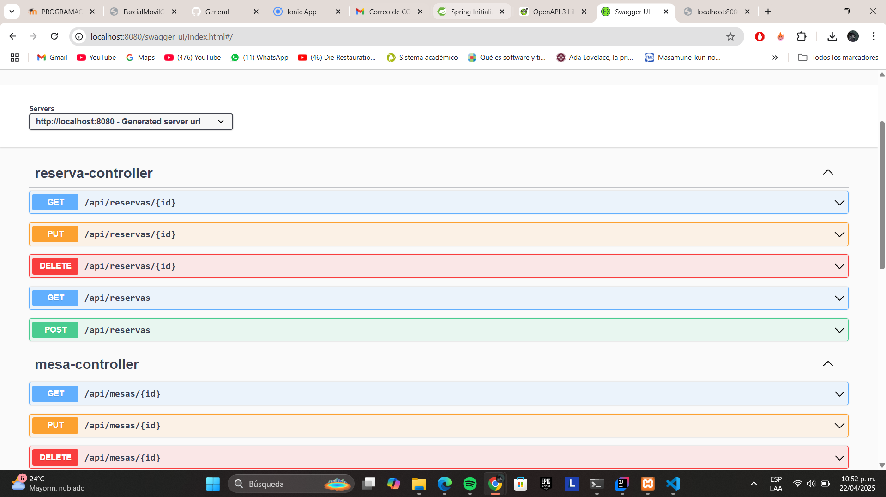
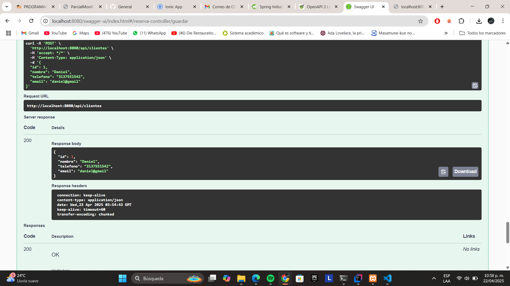
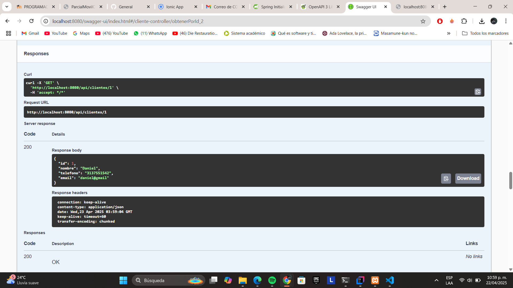

# Historia de Usuario - HU5: Backend Funcional

## Descripción

Como desarrollador del sistema de gestión de reservas para restaurante, necesito un backend funcional que exponga una API REST con operaciones CRUD completas, de forma que se puedan gestionar las reservas realizadas por los clientes, incluyendo la fecha/hora, el cliente y la mesa reservada.

## Criterios de Aceptación

- El sistema debe permitir:
  - Crear una nueva reserva con cliente, fecha/hora y mesa.
  - Consultar todas las reservas o una específica por su ID.
  - Editar una reserva existente.
  - Eliminar una reserva.
- La API debe estar documentada mediante Swagger/OpenAPI.
- La documentación debe estar disponible desde el navegador.
- El backend debe estar preparado para conectarse a una base de datos MySQL.
- Las entidades deben ser congruentes con los datos gestionados en el frontend.

## Implementación Técnica

- **Framework**: Spring Boot `3.4.4`
- **Librerías principales**:
  - `spring-boot-starter-web`
  - `spring-boot-starter-data-jpa`
  - `mysql-connector-j`
  - `springdoc-openapi-starter-webmvc-ui` `2.2.0`
- **Base de datos**: MySQL
- **Documentación API**: Swagger UI (`http://localhost:8080/swagger-ui.html`)
- **Entidades implementadas**:
  - `Cliente`: nombre, correo, teléfono, etc.
  - `Mesa`: número, capacidad.
  - `Reserva`: fecha, hora, cliente, mesa.

## Estructura del Proyecto

```
/back
 └── src
     └── main
         ├── java/com/corhuila/first
         │   ├── controller/
         │   ├── entity/
         │   ├── repository/
         │   └── service/
         └── resources
             └── application.properties
```

## Endpoints Disponibles

- `GET /api/cliente`: listar todas las reservas
- `GET /api/cliente/{id}`: obtener una reserva por ID
- `POST /api/cliente`: crear una nueva reserva
- `PUT /api/cliente/{id}`: actualizar una reserva existente
- `DELETE /api/cliente/{id}`: eliminar una reserva

 **Maneja los mismos Endpoints para los demas Disponibles.**

## Evidencias

### Swagger UI funcionando



### Crear Reserva



### Consultar Reservas



## Documentación Swagger

La documentación interactiva de la API se encuentra en:

```
http://localhost:8080/swagger-ui.html
```

Desde esta interfaz se puede:
- Visualizar la documentación completa de los endpoints.
- Probar los métodos CRUD desde el navegador.
- Ver los esquemas de datos de las entidades.

## Pruebas Realizadas

- Se probó la creación, lectura, actualización y eliminación de clientes desde Swagger UI.
- Se validó la persistencia en MySQL.
- Se verificó el acceso a Swagger desde el navegador.
