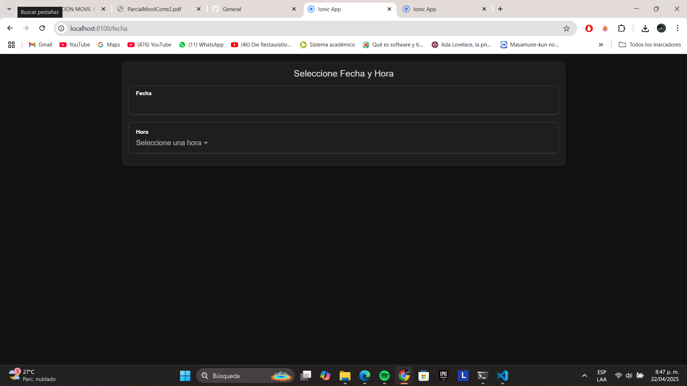

# Historia de Usuario - HU-1: Componente de Fecha y Hora

## Descripción

El objetivo de esta historia de usuario es implementar un componente reutilizable que permita al usuario seleccionar la fecha y la hora en la que desea realizar una reserva en el restaurante. Este componente es esencial para garantizar que las reservas se realicen en momentos válidos y disponibles.

## Desarrollo Técnico

- **Nombre del componente:** `FechaHoraComponent`
- **Ubicación:** `/app/src/app/fecha-hora/`

### Estructura HTML

- Se utilizó un `ion-card` para encapsular visualmente el formulario de selección.
- Se implementaron dos campos con `ion-datetime`: uno para la fecha y otro para la hora.
- Los títulos se colocaron encima de cada campo de forma visible, sin labels flotantes, como parte del diseño solicitado.

### Lógica en TypeScript

- Se utilizó un `FormGroup` con `FormBuilder` para gestionar el formulario reactivo.
- Se implementó el método `getDatosFechaHora()` para exponer los valores seleccionados al componente padre.
- Se añadió la validación `Validators.required` para ambos campos.
- El método `esValido()` permite al componente padre validar que ambos campos estén diligenciados antes de confirmar la reserva.

### CSS Aplicado

- El estilo se aplicó localmente desde `fecha-hora.component.scss`.
- Se usaron márgenes internos (`padding`) y externos (`margin`) para espaciar correctamente los elementos.
- Los campos se alinearon verticalmente con espacio entre ellos y títulos en negrita.

## Pruebas y Validaciones

- Se validó que al intentar enviar el formulario sin seleccionar fecha u hora, se muestre una alerta desde el componente padre.
- Se confirmó que los datos enviados al componente padre coinciden con los seleccionados.
- El diseño fue probado para verse correctamente tanto en móvil como en escritorio.

## Capturas de Pantalla

- `fecha-hora-campo.png`: muestra los campos de fecha y hora con títulos visibles.
