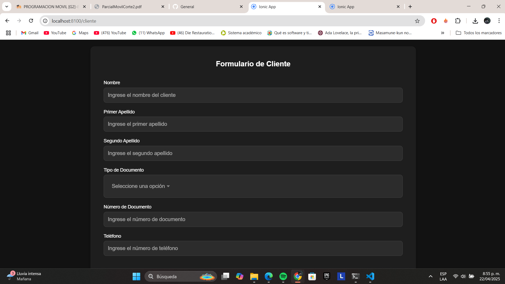

# Historia de Usuario - HU-2: Componente de Datos del Cliente

## Descripción

El objetivo de esta historia de usuario es implementar un componente reutilizable para que el usuario pueda ingresar sus datos personales al momento de realizar una reserva. Esta información es esencial para identificar al cliente, comunicarse con él y gestionar correctamente las reservas.

## Desarrollo Técnico

**Nombre del componente**: `ClienteComponent`  
**Ubicación**: `/app/src/app/cliente/`

### Estructura HTML

- Se utilizó un `ion-card` para encerrar visualmente el formulario de cliente y mantener la coherencia estética con otros componentes.
- Se implementaron campos de entrada con `ion-input` para:
  - Nombre del cliente
  - Correo electrónico
  - Teléfono
- Todos los campos tienen títulos (`h3`) visibles encima del campo de entrada, en lugar de etiquetas flotantes, siguiendo la guía de estilo establecida.
- El formulario es simple, directo y fácilmente comprensible.

### Lógica en TypeScript

- Se usó `FormGroup` y `FormBuilder` para crear un formulario reactivo con validaciones.
- Campos validados con `Validators.required` para nombre, correo y teléfono.
- El método `getDatosCliente()` permite exponer los datos al componente padre (`ReservasComponent`).
- El formulario puede ser reseteado desde el componente padre después de una reserva exitosa.

### CSS Aplicado

- Los estilos se gestionaron desde el archivo local `cliente.component.scss`.
- Se utilizaron márgenes (`margin-bottom`) y padding para espaciar bien los campos.
- Se aplicó negrita a los títulos (`h3`) y un espaciado armonioso entre los inputs para mantener claridad y orden.

## Pruebas y Validaciones

- Se verificó que todos los campos sean obligatorios. Si alguno está vacío, el formulario no se puede enviar.
- Se comprobaron los valores capturados por el método `getDatosCliente()` y que coinciden con lo ingresado.
- Se probó que el formulario se pueda resetear correctamente después de registrar una reserva.

## Capturas de Pantalla

- `cliente-formulario.png`: muestra los campos de nombre, correo y teléfono correctamente distribuidos.

- `cliente-validacion.png`: validación que impide enviar el formulario si los campos están vacíos.