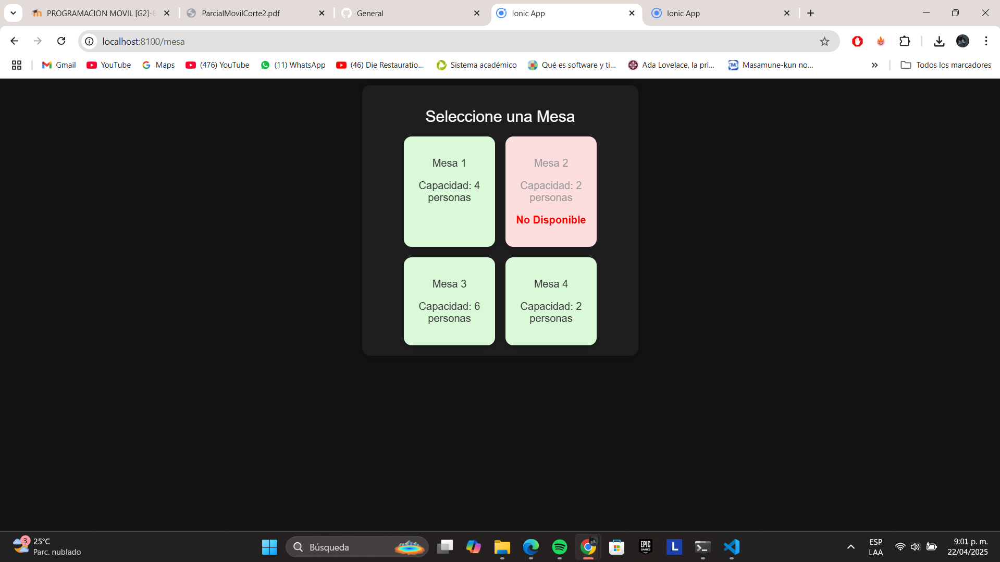
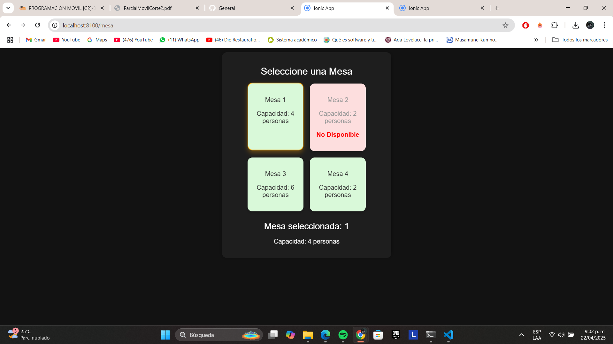
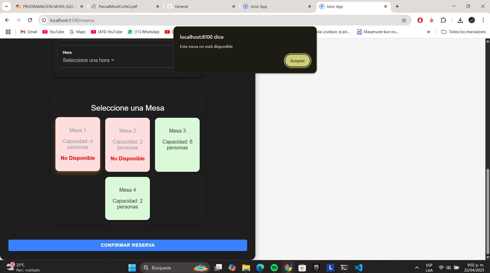

# Historia de Usuario - HU-3: Componente de Selección de Mesa

## Descripción

El objetivo de esta historia de usuario es implementar un componente reutilizable que permita al usuario seleccionar una mesa disponible para realizar una reserva en el restaurante. Este componente se conecta con la lógica general de la reserva, asegurando que solo se puedan seleccionar mesas no ocupadas.

## Desarrollo Técnico

- **Nombre del componente**: `MesaComponent`  
- **Ubicación**: `/app/src/app/mesa/`

## Estructura HTML

- Se utilizó un `ion-card` que contiene una cuadrícula de botones (`ion-buttons`) representando cada mesa disponible.
- Las mesas se visualizan en un diseño tipo "grid" para simular un plano del restaurante.
- Las mesas ocupadas aparecen con un color distinto o deshabilitadas para evitar que se seleccionen nuevamente.

## Lógica en TypeScript

- Se definió un arreglo `mesas` con los datos de las mesas (ID, disponibilidad, etc.).
- El usuario puede seleccionar una mesa haciendo clic, y esta se almacena en la variable `selectedMesa`.
- Método `getMesaSeleccionada()` devuelve el objeto de la mesa elegida.
- Método `marcarMesaComoNoDisponible()` actualiza el estado de disponibilidad después de la confirmación de la reserva.
- Se emitieron logs para pruebas de selección en consola.

## CSS Aplicado

- El estilo se aplicó desde `mesa.component.scss`.
- Se usaron colores diferenciados para representar la disponibilidad (`verde` para disponibles, `gris` para no disponibles).
- Las mesas están estilizadas como botones redondeados con márgenes uniformes.
- Se aplicó `display: flex` y `flex-wrap` para adaptar el diseño de la cuadrícula.

## Pruebas y Validaciones

- Se validó que solo una mesa pueda estar seleccionada a la vez.
- Se verificó que una vez reservada una mesa, no se pueda volver a seleccionar hasta reiniciar la app o borrar datos (simulación).
- Se confirmó que el componente padre recibe correctamente la mesa seleccionada.
- Pruebas visuales aseguran buena experiencia en móvil y escritorio.

## Capturas de Pantalla

1. `mesa-disponibles.png`: muestra la vista de mesas disponibles.

2. `mesa-seleccionada.png`: evidencia visual de la mesa seleccionada.

3. `mesa-ocupada.png`: mesas ya reservadas, deshabilitadas.
