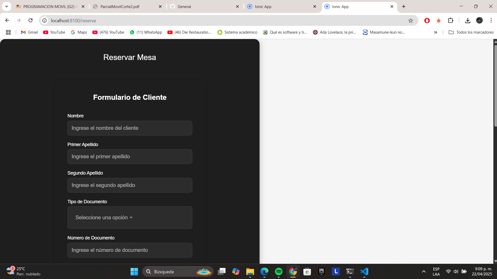
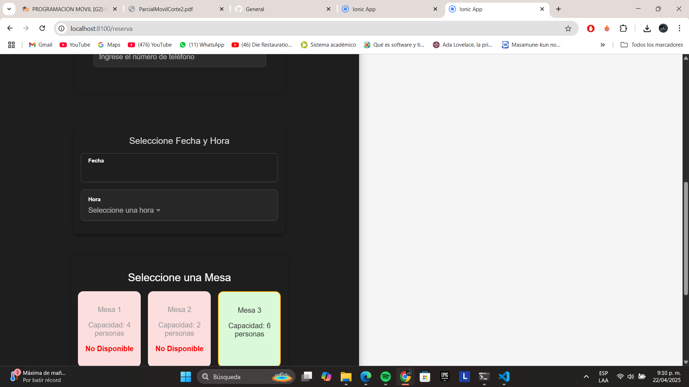
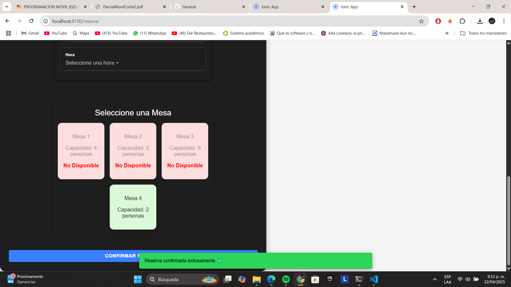

# Historia de Usuario - HU-4: Pantalla Principal que Integra Todos los Componentes

---

## Descripción

Esta historia de usuario tiene como objetivo desarrollar una pantalla principal que unifique y orqueste los tres componentes fundamentales del sistema de reservas del restaurante: selección de fecha y hora, ingreso de datos del cliente y selección de mesa. Además, desde esta vista se debe permitir al usuario confirmar una reserva y visualizar una lista de las reservas confirmadas.

---

## Desarrollo Técnico

### Nombre del componente: `ReservasComponent`

### Ubicación: `/app/src/app/reservas/`

---

## Estructura del HTML

- Se utilizó un `<ion-content>` con una clase `reserva-content` para contener todo el contenido.
- Dentro se agregó una tarjeta visual (`<div class="contenedor-reserva">`) que organiza los elementos con separación y estilo.
- Se incluyeron los tres componentes reutilizables:

  ```html
  <app-cliente></app-cliente>
  <app-fecha-hora></app-fecha-hora>
  <app-mesa></app-mesa>
  ```

- Un botón de acción principal permite confirmar la reserva:

  ```html
  <ion-button expand="block" (click)="confirmarReserva()">
    Confirmar Reserva
  </ion-button>
  ```

---

## Lógica en TypeScript

- Se usó `@ViewChild` para acceder directamente a los métodos de los componentes hijos (`ClienteComponent`, `FechaHoraComponent`, `MesaComponent`).
- Se utilizó el servicio `ReservaService` para guardar y recuperar las reservas.
- El método `confirmarReserva()` hace lo siguiente:

  1. Obtiene los datos de los tres componentes hijos.
  2. Valida que todos los campos estén diligenciados correctamente.
  3. Muestra un `ToastController` si hay errores.
  4. Si todo es válido, guarda la reserva en el servicio.
  5. Resetea los formularios y deselecciona la mesa.

- También se llama a un `ToastController` para mostrar mensajes al usuario.

---

## CSS Aplicado

- Los estilos están definidos en `reservas.component.scss`.
- Se aplica diseño limpio y espaciado entre secciones.
- Se usa `display: flex`, `flex-direction: column` y `gap` para organizar verticalmente los bloques.
- El botón principal está centrado y ocupa el ancho total del contenedor.

---

## Pruebas y Validaciones

- Se probó que no se permita confirmar una reserva sin seleccionar todos los datos requeridos.
- Se validó que las reservas ingresadas se reflejan inmediatamente en la lista.
- El botón y formularios se adaptan visualmente a distintos tamaños de pantalla.
- Se verificó que el flujo completo de reserva es fluido y sin errores.

---

## Capturas de Pantalla



1. `pantalla-principal-formulario.png`: Vista de los tres formularios integrados.


2. `pantalla-principal-reserva-confirmada.png`: Ejemplo de reserva realizada.


3. `pantalla-principal-validacion.png`: Validaciones de campos obligatorios.